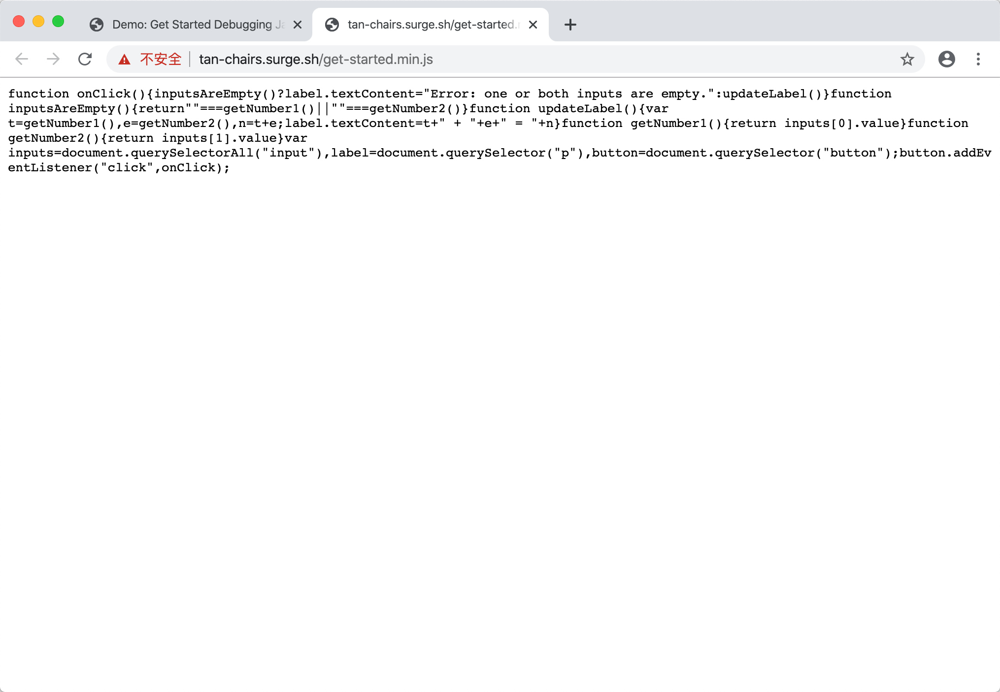

# 在Chrome中调试网页

根据标题会知道，本文描述的所有内容都是基于Chrome浏览器，至于为什么没说Firefox 、Safari、IE 等浏览器？
- 首先，Chrome 已经足够好用，其他浏览器提供的调试功能，Chrome 基本都有，其他浏览器没有的调试功能，Chrome大部分也都有；
- 另外，本人对Chrome相对了解多一些。😄

Chrome调试，主要是通过开发者工具DevTools进行，网页调试功能主要几种在DevTools工具的Elements及Sources面板中。接下来，将在这两个面板中，分别对html、css、js 进行调试演示。


## 功能

<!-- TOC -->

- [在Chrome中调试网页](#在chrome中调试网页)
  - [功能](#功能)
  - [html 调试](#html-调试)
    - [添加属性](#添加属性)
    - [编辑属性](#编辑属性)
    - [删除节点](#删除节点)
    - [编辑节点](#编辑节点)
  - [css 调试](#css-调试)
    - [Style 窗格调试](#style-窗格调试)
    - [样式文件内调整](#样式文件内调整)
  - [js 调试](#js-调试)
    - [常规调试](#常规调试)
    - [本地调试](#本地调试)
  - [总结](#总结)
  - [资源参考](#资源参考)

<!-- /TOC -->

## html 调试

以百度网址www.baidu.com 为例，我们尝试在百度logo图片上进行接下来的调试演示
### 添加属性

在Elements 面板中，选中logo图片，DevTools 会自动帮我们高亮定位到对应到dom 节点，鼠标右键改节点，弹出到菜单中，我们选择「Add attribute」,DevTools 会在当前logo节点末尾处多处一段空白到输入区域，这里我们可以输入一些当前节点属性，很灵活，很方便；编辑完成后，点击输入区域以外任意区域，或者回车键确认，添加属性会立即生效。比如我们在当前节点上增加style="display:none" 后，点击区域外任意区域后，当前图片会立即消失。


### 编辑属性

触发某个属性的编辑状态，有两种比较简便的方式，一种是鼠标悬停在对应属性上，鼠标右键，点击功能菜单中的「Edit attribute」；另外一种方式是鼠标双击对应属性，任意一种方式操作后，对应属性，会处于可编辑状态，修改成相应属性值后，点击其它区域，或者回车，属性同样会立即生效。


### 删除节点

删除节点比较容易，右键弹出功能菜单，选择「Delete element」后，对应logo 图片会立即消失

### 编辑节点

鼠标右键在logo后，选择「Edit as HTML」,可以完成对当前dom元素的调整，比如编辑属性，同时还可以在当前dom节点的前后，或者内部插入其它html标签，编辑完成后，编辑完成后，点击输入区域以外，修改立即生效，注意，这个时候，点击回车按钮，并不会生效，此时的回车只是换行功能。


## css 调试

### Style 窗格调试

Style 窗格是什么，如下图：


选中dom 元素后，窗格内会显示当前元素的相关样式定义，在对应定义处进行修改，修改会即刻生效


### 样式文件内调整

style 窗格内，每一处样式定义，都会在右侧标明出处，出处有两种形式：
- 一种是系统内置，样式内容不可编辑，出处链接不可点击；
- 另外一种是用户定义，可编辑，点击出处链接，会跳转到DevTools工具的Sources面板，并高亮定位到对应的样式定义处，如果当前样式是定义在html文件中，样式不可编辑，如果打开的是单独的css文件，则可直接在当前样式文件内进行调试修改，如果当前css 文件调整比较多，可以直接将修改完成的样式文件，替换项目里对应文件，即能可视化调整，也能同步完成项目内源码调整。

## js 调试

上面说了html调试，说了css 调试，似乎总感觉缺点什么，对，怎么一直没提断点，我们先来看下断点的定义：
>调试设置断点可以让程序运行到该行程序时停住，借此观察程序到断点位置时，其变量、寄存器、I/O等相关的变量内容，有助于深入了解程序运作的机制，发现、排除程序错误的根源。

所以断点只是辅助调试的一种手段，一种让线索更加清晰，问题更容易暴露的方法，而在html、css调试时，由于并没有复杂的业务逻辑，代码调试非常直观，所以用不着。

### 常规调试

这里的「常规调试」，是相对「本地调试」而言，下一章节将具体说明。

可在DevTools Sources面板中可对js 进行调试，Sources面板包括三个部分：


- File Navigator 窗格。 此处列出页面请求的每个文件。
- Code Editor 窗格。 在 File Navigator 窗格中选择文件后，此处会显示该文件的内容。
- JavaScript Debugging 窗格。 检查页面 JavaScript 的各种工具。 如果 DevTools 窗口布局较宽，此窗格会显示在 Code Editor 窗格右侧。

来看一个谷歌关于Sources面板调试js示例，[地址在这里](https://googlechrome.github.io/devtools-samples/debug-js/get-started)。

通过分析代码，我们可以知道，点击求和按钮后，页面会出现2类结果：
- 两个输入框部分输入，结果显示“Error: one or both inputs are empty.”
- 两个输入完全输入，结果显示两个数字的和

通过执行代码，部分输入的情况，程序运行，完全符合我们的预期，不存在问题。

完全输入情况下，比如两个数字分别填写5和1，当点击下方求和按钮后，得到的结果是51，而不是正确答案6，我们知道，应该是程序的某个地方出现了问题，在不能确定故障原因情况下，我们对js代码进行调试。

通过上述两种情况的判断，我们判断，程序应该是在 updateLabel 方法里出现了异常，为了进一步缩小调试范围，根据结果，异常出现在结果显示处，所以我们将断点设置在对应代码行 32，点击32行行号后，行号上会出现一个蓝色的箭头图标。现在点击按钮，会发现代码执行到32行处后停止了，如下图：


addend1、addend2 和 sum 的值疑似有问题。 这些值位于引号中，这意味着它们是字符串。 这个假设有助于说明错误的原因。

正如猜想，sum 的求值结果本应是数字，而实际结果却是字符串。现在已确定这就是错误的原因。

接下来，就是按照分析出来的错误原因进行代码修改，因为两个数字求和，所以，我们对31行代码进行修改，将
```
var sum = addend1 + addend2;
```
改成
```
var sum = parseInt(addend1) + parseInt(addend2);
```

有个小细节注意下，当我修改来31行代码后，js文件右上角会多处一个*号，这表示修改的代码并未生效，此时快捷键Command+S进行保存后，*号将消失，前方会多处一个感叹号（不用纠结感叹号），重新点击求和按钮，断点依旧会在32行处停止，sum的值类型已经变成数字类型，结束调试，结果也是预期的6。

至此，js 常规调试说明完毕。

### 本地调试

先说明一下，本段所说的本地调试的基本技巧，同样适用于html、css 等。

通常，为了对网页加载优化，或者不希望逻辑代码赤裸裸的暴露，我们会对js代码ugly处理，丑到爹妈都不认识，想象一下，如果这个时候，线上环境出现了问题，该如何调试。

为了演示，将上节这中示例代码下载到本地，并对get-started.js代码进行ugly，并重命名为get-started.min.js,同时修改get-started.html中js引用，运行结果如下：




注意到get-started.min.js文件里代码可读性非常差，下面将演示，在这种情况下，如何对js进行调试：

1、切换到Sources-Overrides 面板
在File Navigator 窗格里，切换到Overrides面板。

2、添加本地文件目录到workspace
切换到Overrides后，窗格里会出现Add folder to workspace按钮，在磁盘合适位置选择一个文件目录，选中目录后，浏览器会弹出一个要求完全访问权限的对话框，本着对大厂浏览器对盲目崇拜，我都是点击「允许」，添加完成后，选中的磁盘目录会映射到当前窗格里。

3、返回Page 面板，鼠标右键点击get-started.min.js文件，弹出菜单里会都出一项功能「Save for overrides」,效果分别如下图


4、点击get-started.min.js文件，在Code Editor 窗格处，将没有ugly处理到源代码粘贴覆盖，记得Command+S 保存。

5、接下来的调试过程，如上一节常规调试一样

## 总结

本文简单对Chrome进行前端调试对一些入门方法进行介绍，工欲善其事，必先利其器，Chrome 对于前端开发人员来说，不仅仅是一款网页浏览工具，同时也是一款开发效率工具，功能也不仅限调试。

## 资源参考
[Markdown TOC](https://marketplace.visualstudio.com/items?itemName=AlanWalk.markdown-toc)

[Tools for Web Developers](https://developers.google.com/web/tools/chrome-devtools)
